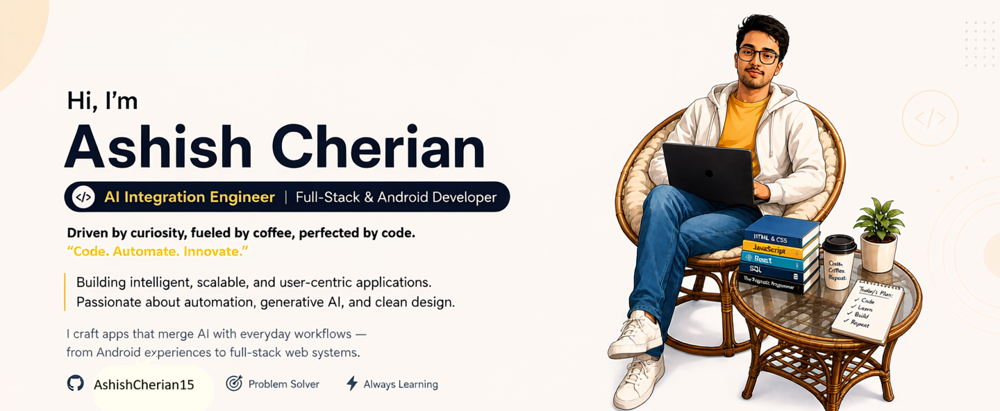

<!-- ========================================================= -->
<!--                  ASHISH CHERIAN — PROFILE                 -->
<!-- ========================================================= -->

<div align="center">

<!-- PROFILE BANNER -->


<br/>

<!-- TYPING HEADER -->
<a href="https://github.com/AshishCherian15">
  
</a>

<br/>

<!-- SOCIAL LINKS -->

<a href="https://github.com/AshishCherian15">
  
</a>

<a href="https://linkedin.com/in/ashish-cherian-158b49356">
  
</a>

<a href="mailto:ashishcherian15@gmail.com">
  
</a>

<a href="https://portfolio-green-nine-18.vercel.app/">
  
</a>

<br/><br/>

<!-- DYNAMIC PROFILE VIEWS -->


</div>

---

# 💫 About Me

<div align="center">

<a href="https://github.com/AshishCherian15">
  
</a>

</div>

<br/>

### 👨‍💻 Who am I?

- 🎓 **B.E Computer Science & Engineering** — Karavali Institute of Technology, VTU
- 📅 **2022 – 2026**
- 📊 **CGPA: 8.41 / 10 — First Class with Distinction**
- 💼 Open to **Software Developer / Android Developer / Full-Stack Developer** opportunities
- 📍 Mangalore, Karnataka, India
- 🤖 Interested in **AI, LLM applications, Android development and full-stack systems**
- 🚀 Building practical applications with **Kotlin, React, Django, FastAPI, Firebase and AI APIs**

### 🔭 Currently Building

- Production-grade Android applications
- AI-powered applications using Gemini and LangChain
- Full-stack web applications
- Scalable backend APIs
- Intelligent automation systems

---

# ⚙️ Tech Stack

### 💻 Languages


### 🎨 Frontend & Mobile


### ⚙️ Backend & Databases


### 🤖 AI / ML & Tools


---

# 🏢 Professional Experience

<details open>
<summary><b>🔥 MindMatrix · CL Infotech — Android App Development Intern (Gen AI)</b></summary>

**Feb – May 2026**

**Rating: ⭐ EXCELLENT**

- Built **Hasta-Kala Shop**, a 13-screen artisan business management Android application
- Integrated **Google Gemini AI** using Google AI Studio
- Implemented **Firebase Authentication**
- Implemented real-time **Cloud Firestore** synchronization
- Fixed a critical **LiveData synchronization bug**
- Worked with:
  - `Kotlin`
  - `Jetpack Compose`
  - `Firebase`
  - `Gemini API`
  - `Room DB`

</details>

<details open>
<summary><b>💼 CodeLab Systems, Mangalore — React.js Frontend Developer Intern</b></summary>

**May 2025**

**Award: 🏆 Certificate of Appreciation**

- Developed responsive React.js components
- Improved component reusability
- Worked with production frontend code
- Technologies:
  - `React.js`
  - `JavaScript`
  - `CSS`

</details>

<details open>
<summary><b>🎓 Deloitte Australia — Forage Industry Simulations</b></summary>

**Mar – Apr 2026**

- **Cybersecurity:** Analysed web server logs and identified suspicious activity patterns
- **Data Analytics:** Worked with data visualization and business intelligence workflows
- **Technology:** Completed technology consulting simulation

</details>

---

# 🚀 Featured Projects

## 🥇 Hasta-Kala Shop

**Android + AI Artisan Business Manager**

`Kotlin` `Jetpack Compose` `Firebase` `Gemini API` `Room DB`

- 13-screen Android application
- Sales, inventory and income management
- Offline-first architecture
- Gemini AI integration
- Firebase authentication and database synchronization
- Built during MindMatrix internship
- ⭐ Rated **EXCELLENT**

🔗 **Repository:**  
https://github.com/AshishCherian15/Hasta-Kala-Shop

---

## 🥈 Study Bot

**LLM-Powered Study Companion**

`FastAPI` `LangChain` `Groq LLaMA 3` `MongoDB`

- AI study assistant
- Persistent session memory
- Context-aware multi-turn conversations
- REST API architecture
- Deployed application

🔗 **Repository:**  
https://github.com/AshishCherian15/study-bot

---

## ⭐ SnipFlow

**AI Code Snippet Organizer — Android**

`Kotlin` `Jetpack Compose` `Gemini AI SDK` `Room DB`

- Offline-first Android application
- Save and organize code snippets
- Tag-based organization
- AI-powered code explanations
- Multi-language support

🔗 **Repository:**  
https://github.com/AshishCherian15/SnipFlow-Snippet-Code-Organizer-Andriod-App

---

## 🎯 Multi-Stock Logistics Platform

`Django` `PostgreSQL` `REST API` `Chart.js`

- Warehouse and logistics management
- Multi-vendor architecture
- Real-time analytics dashboard
- Inventory and logistics management
- Data visualization

🔗 **Repository:**  
https://github.com/AshishCherian15/Multi-Stock-Logistics-Platform

---

## 🏥 Pharmacy Supply Management System

`Flask` `PostgreSQL` `Chart.js`

- Role-based authentication
- Admin and customer workflows
- Order lifecycle management
- KPI dashboard
- CSRF-protected authentication

🔗 **Repository:**  
https://github.com/AshishCherian15/Pharmacy-Supply-Management-System

---

## 📊 Amazon Sales Analytics Dashboard

`Flask` `Pandas` `Chart.js` `Python`

- Business intelligence dashboard
- Amazon sales analytics
- Data visualization
- Interactive reports

🔗 **Repository:**  
https://github.com/AshishCherian15/Amazon-Sales-Analysis

---

# 🏆 Certifications

| Certification | Issuer | Date | Status |
|---|---|---|---|
| Deloitte Cybersecurity Job Simulation | Forage | Mar 2026 | ✓ Verified |
| Deloitte Data Analytics Job Simulation | Forage | Apr 2026 | ✓ Verified |
| Deloitte Technology Job Simulation | Forage | Apr 2026 | ✓ Verified |
| NPTEL — Privacy & Security | IIT Kharagpur | 2025 | ✓ Elite Grade |
| Salesforce Agentforce / Agentblazer | Trailhead | 2025 | ✓ Skills Badge |
| Google Developer Program | Google | 2026 | ✓ Active Member |

---

# 🏆 GitHub Achievements & Trophies

<div align="center">

<a href="https://github.com/AshishCherian15?tab=achievements">
  
</a>

</div>

---

# 📊 GitHub Statistics

<!--
These values are generated dynamically from GitHub.
No follower, repository, star, commit or language numbers
are manually hard-coded here.
-->

<div align="center">

<a href="https://github.com/AshishCherian15">
  
</a>

<a href="https://github.com/AshishCherian15">
  
</a>

</div>

---

# 🔥 GitHub Contribution Streak

<div align="center">

<a href="https://github.com/AshishCherian15">
  
</a>

</div>

---

# 📈 GitHub Contribution Activity

<div align="center">

<a href="https://github.com/AshishCherian15">
  
</a>

</div>

---

# 📌 My GitHub Profile

<div align="center">

<a href="https://github.com/AshishCherian15">
  
</a>

<a href="https://github.com/AshishCherian15?tab=repositories">
  
</a>

<a href="https://github.com/AshishCherian15?tab=achievements">
  
</a>

</div>

---

# 🎯 What I'm Working On

```text
🤖 Building AI-powered applications
📱 Developing production-grade Android applications
🌐 Building scalable full-stack applications
🧠 Exploring LLMs, LangChain and AI agents
🔧 Improving backend architecture and APIs
📚 Learning advanced ML and AI engineering
🚀 Contributing to open-source projects
```

---

# 📫 Let's Connect

<div align="center">

<a href="mailto:ashishcherian15@gmail.com">
  
</a>

<a href="https://linkedin.com/in/ashish-cherian-158b49356">
  
</a>

<a href="https://github.com/AshishCherian15">
  
</a>

<a href="https://portfolio-green-nine-18.vercel.app/">
  
</a>

<a href="https://www.skills.google/public_profiles/97a9df8a-1d9d-4816-a8e0-a30f5a1ab289">
  
</a>

<a href="https://www.salesforce.com/trailblazer/oq1wg5nl5neu3wzyhf">
  
</a>

</div>

---

<div align="center">

### 💭 *"Code today, impact tomorrow."*

**Ashish Cherian**

<br/>

⭐ **Explore my repositories and projects**

</div>
